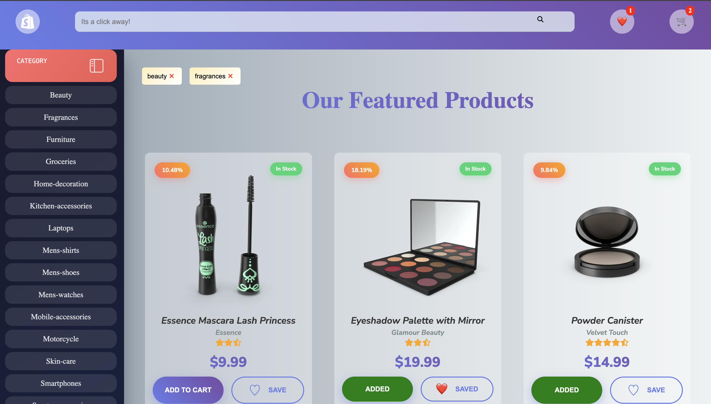
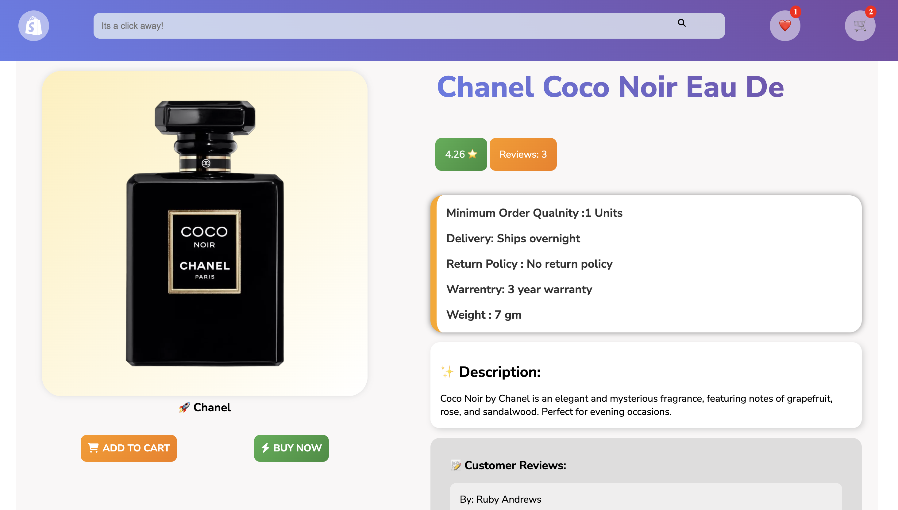
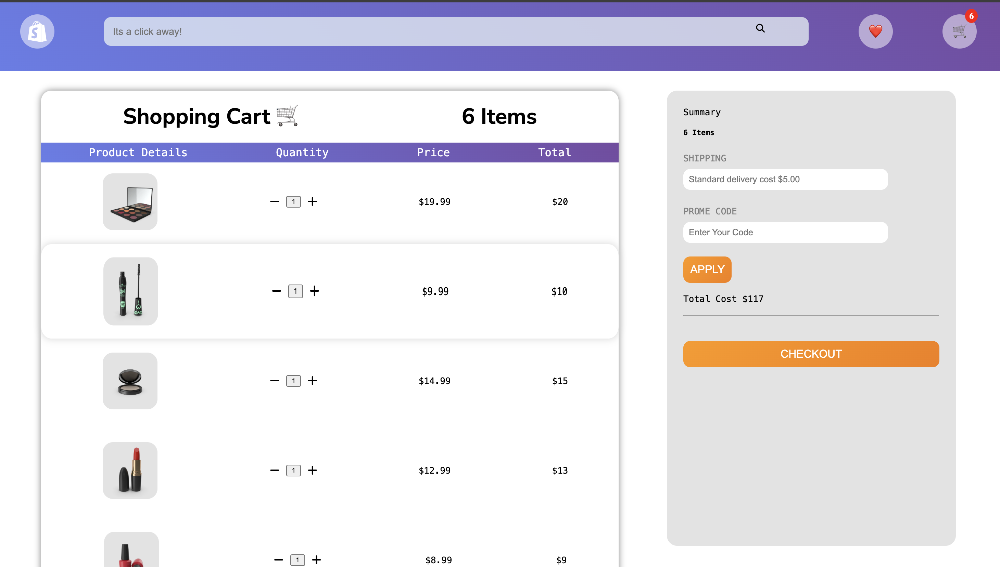

# 🛒 The E-market

## Description

**The E-market** is a responsive and interactive online shopping application built with React. It offers a seamless user experience for browsing, searching, liking, and purchasing products. The design is optimized for both desktop and mobile devices, ensuring a smooth experience across all platforms.

---

## ✨ Features

- ✅ **Responsive Design** – Mobile-first layout using CSS Flex and Grid
- 🛍️ **Landing Page** – Clean, modern, and user-friendly interface
- 📦 **Products Listing** – Keyword search with pagination
- 📂 **Category Filtering** – Easily browse by product categories
- ❤️ **Liked Items** – Like/unlike items and persist using local storage
- 🛒 **Cart System** – Add/remove items, with real-time total calculation
- 🔍 **Search Functionality** – Live search with debounce
- 📄 **Multi-page Navigation** – Home, Products, Product Details, Cart, and Liked Items
- 💾 **Local Storage** – Persists cart and liked items between sessions
- ⏳ **Loading States** – Smooth UX with SVG loader integration

---

## 🖼️ Screenshots





---

## Live Demo

👉 [**Click here to view the deployed app**](https://your-demo-link.com)

---

## Tech Stack

| Tech              | Usage                            |
| ----------------- | -------------------------------- |
| **React.js**      | Frontend Framework               |
| **JSX/CSS**       | UI Structure and Styling         |
| **Context API**   | Global State Management          |
| **React Router**  | Page Navigation                  |
| **Font Awesome**  | Icons                            |
| **Local Storage** | Persistent Cart and Liked Items  |
| **SVG Loader**    | [loading.io](https://loading.io) |
| **DummyJSON API** | Product and category data source |

## Vite Configuration

This project uses **Vite** as the build tool, which provides:

- Extremely fast development server startup
- Hot Module Replacement (HMR)
- Lightning-fast production builds
- Simple and readable project structure

## How It Works

- **Cart & Liked Items**: Stored in `localStorage` to persist across sessions.
- **Search**: Live search filter based on product titles.
- **Category Filtering**: Dynamically fetched from API and rendered.
- **Pagination**: Implemented manually for better control and flexibility.

## Doucment structure

```bash

src/
│
├── assets/          # Images, icons, etc.
├── components/
├── context/       # Reusable UI components
├── pages/
├── Ui
├── App.jsx
└── app.css
```

## Installation & Run Locally

```bash
git clone https://github.com/vandanafuloria/e-market.git

cd e-market

npm install

npm run dev


```

## 📬 Contact Me

- **🔗 [LinkedIn](https://www.linkedin.com/in/vandana-fuloria/)**
- **📩 [Gmail](vandanafuloria02@gmail.com)**
